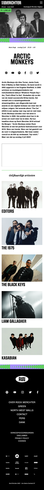
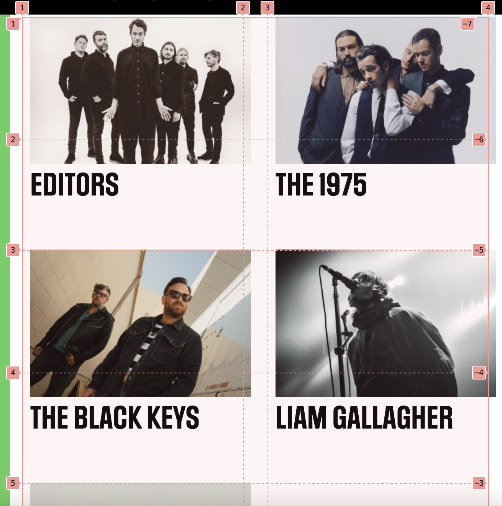
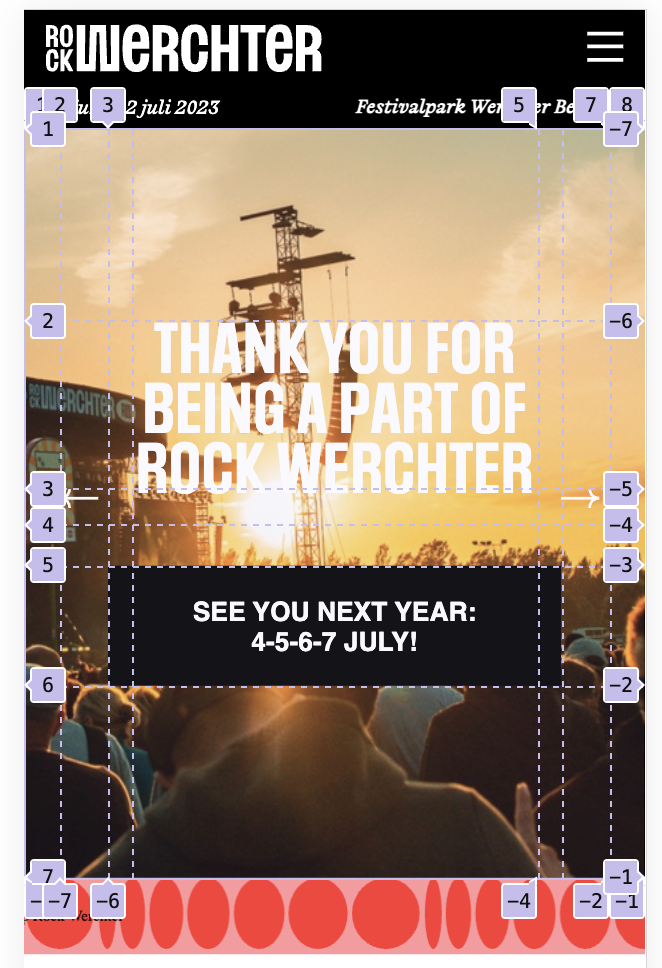
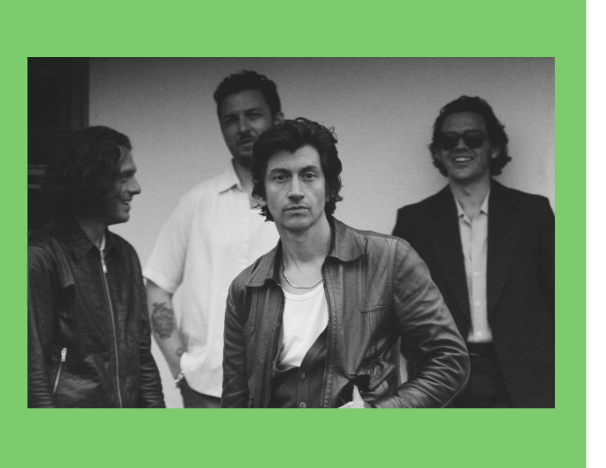
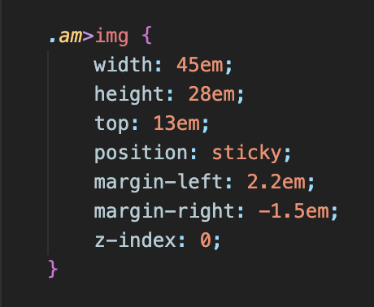
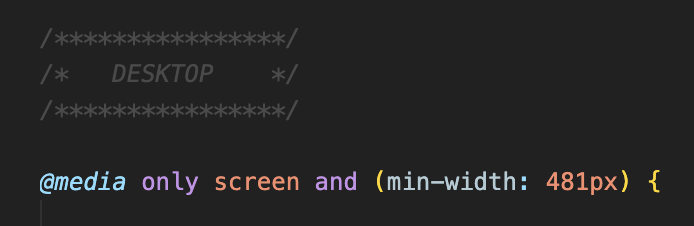
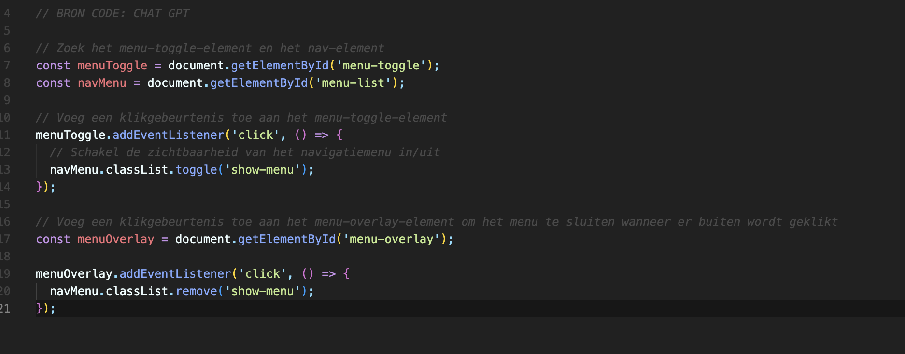
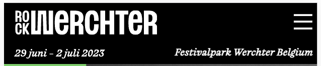
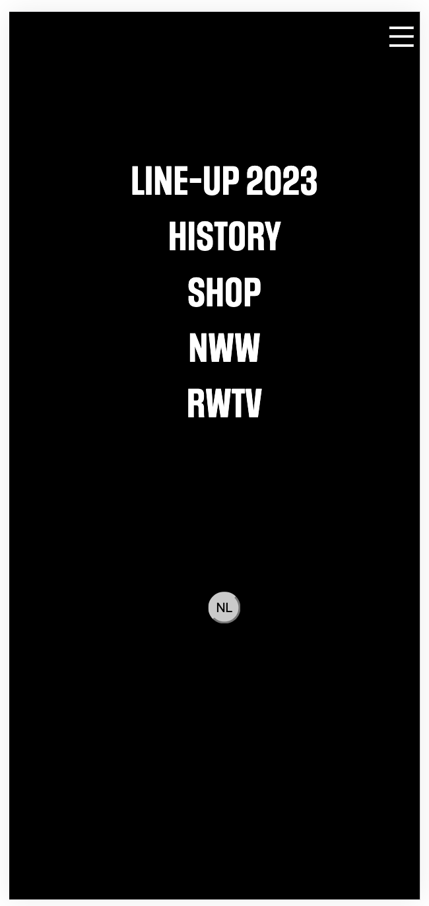

# Procesverslag
Markdown is een simpele manier om HTML te schrijven.  
Markdown cheat cheet: [Hulp bij het schrijven van Markdown](https://github.com/adam-p/markdown-here/wiki/Markdown-Cheatsheet).

Nb. De standaardstructuur en de spartaanse opmaak van de README.md zijn helemaal prima. Het gaat om de inhoud van je procesverslag. Besteedt de tijd voor pracht en praal aan je website.

Nb. Door *open* toe te voegen aan een *details* element kun je deze standaard open zetten. Fijn om dat steeds voor de relevante stuk(ken) te doen.

## Jij

  
uitwerken voor kick-off werkgroep

  ### Auteur:
  Jade van der Hoorn

  #### Je startniveau:
  blauw

  #### Je focus:
  responisve
 

## Je website

  
uitwerken voor kick-off werkgroep

  ### Je opdracht:
  https://www.rockwerchter.be/nl/

  #### Screenshot(s) van de eerste pagina (small screen): 
  Home Pagina
  

  #### Screenshot(s) van de tweede pagina (small screen):
  Detail pagina 
  
 

## Toegankelijkheidstest 1/2 (week 1)

  
uitwerken na test in 2e werkgroep

  ### Bevindingen
  Lijst met je bevindingen die in de test naar voren kwamen:

## Breakdownschets (week 1)

  
uitwerken na afloop 3e werkgroep

  ### de hele pagina: 
  

## Voortgang 1 (week 2)

  
uitwerken voor 1e voortgang

  ### Stand van zaken
  Alles ging deze weken goed, ik moet alleen ervoor zorgen dat ik eerst html geschreven heb voordat ik aan de css begin. Ik ben nu al te veel met details bezig. 

  ### Verslag van meeting
  hier na afloop snel de uitkomsten van de meeting vastleggen

  - Snel aan de tweede pagina beginnen
  - Door gaan met css

## Voortgang 2 (week 3)

  
uitwerken voor 2e voortgang

  ### Stand van zaken
  Ik ben nog steeds lekker bezig met de code. Het mag denk ik wel wat sneller. Ik moet echt even doorzetten met mijn css, zodat ik daarna aan het responsive maken kan beginnen.

## Toegankelijkheidstest 2/2 (week 4)

  
uitwerken na test in 9e werkgroep

  ### Bevindingen
  - meerdere alt teksten van images zijn in het engels ipv nederlands
  - ik ben bij een paar images de alt tekst begonnen met "foto van..." wat niet nodig is.
  - Alt teksten kunnen iets uitgebreider zodat het de plaatjes wat beter omschrijft.
  - De website is goed doorklikbaar met gebruik van het toetsenbord. 

## Voortgang 3 (week 4)

  
uitwerken voor 3e voortgang

  ### Stand van zaken
  Voor het gesprek had ik moeite met het stylen van de mediaquery, maar ik heb even op school er aan gezeten, en toen lukte alles op eens. Ik ben daarom niet het gesprek ingegaan met veel vragen, maar meer met de intentie om gewoon even mijn code te laten checken.

  ### Verslag van meeting

  - Ik heb een paar onnodige divs/sections gebruikt, die moet ik even gaan veranderen.
  - verder moet ik gewoon door gaan met waar ik bezig mee ben.

## Eindgesprek (week 5)

  
uitwerken voor eindgesprek

  ### Je uitkomst - karakteristiek screenshots:

  De detail pagina:
  

  De Home pagina:
  

  ### Dit ging goed/Heb ik geleerd: 
  
  1. Wat voor mij het leukste was om te leren was het werken met grids. Ik heb vaak best wat moeite met het stylen van pagina's met flexbox etc, maar met grid heb ik voor het eerst gehad dat ik het meteen doorhad en dat alles meteen lukte. Ik heb op mijn website twee mooie grids gemaakt waar ik erg trots op ben. Ik had het nog vaker willen gebruiken, maar dit was niet echt noodzakelijk :(. 

  
  

  2. Ik heb op deze website voor het eerst position: sticky gebruikt. Ik dacht dat dit best wel lastig zou zijn, maar dat viel heel erg mee. Het zijn eigenlijk maar twee lijntjes css die er toch voor zorgen dat alles er iets proffesioneler er uit ziet. 

  
  

  3. Wat gelukt is, maar wat me wel wat moeite kostte, was het responsive maken van de website. Omdat ik eerst de styling van het mobiele formaat had, moest ik dat allemaal gaan omzetten. Het was vooral lastig op momenten dat ik iets aan de html moest toevoegen, waardoor de code in mijn css af en toe niet meer werktte. Als ik dan bijvoorbeeld main>img gebruikte, maar later moest ik een div toevoegen, klopte dat niet meer. Het is uiteindelijk wel helemaal gelukt, dus dat is wel iets om trots op te zijn.

  

  ### Dit was lastig/Is niet gelukt:
  
  Ik heb geprobeerd om eerst met een codepen opdracht erachter te komen hoe ik een hamburger menu moest maken die alleen te zien was op een mobiel scherm, maar dit lukte mij niet. Geen idee waar het aan lag, maar ik snapte er niks van. Ik heb dit daarom uiteindelijk aan Chat GPT moeten vragen. Die heeft mij de goede code gegeven waardoor het uiteindelijk wel gelukt is. Ik heb de code ook nog opgezocht zodat ik precies wist wat alles inhield. 

  
  
  
  

## Bronnenlijst

  
continu bijhouden terwijl je werkt

  1. Chat GPT (alleen voor het hamburgermenu/javascript)
  2. Mijn notities van eerdere codeer vakken

